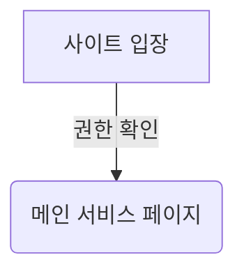

# 메인 서비스 페이지

## 플로우 차트

## 구성

- 메인 서비스 페이지에서는 사용자의 학교, 학과에 맞는 접근 권한이 있는 페이지들을 모아서 보여주며, 기타 기능들을 잘 이용할 수 있도록 하는 메인 서비스 페이지이다.

## 설계 구조

1. 사용자가 어떤 페이지에 접근 권한이 있는지 확인
2. 메인 페이지가 로드될 때, 현재 로그인한 유저가 볼 수 있는 페이지 목록을 반환
3. 프론트에서 백엔드에서 받아온 페이지 목록을 바탕으로 화면 제공

