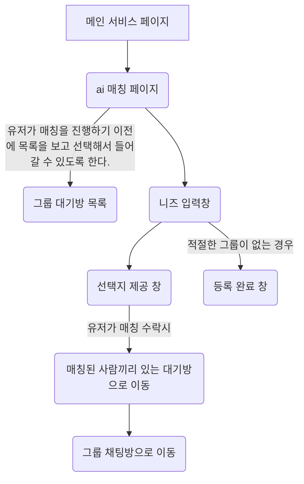
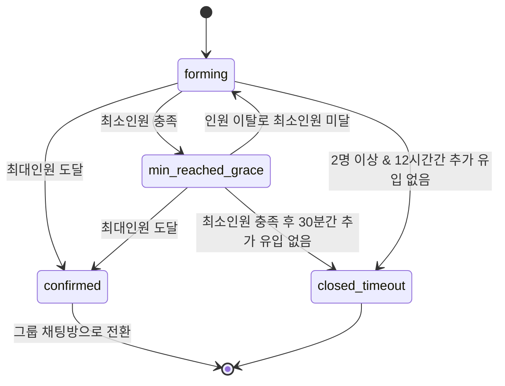

# AI 매칭 서비스 — 기획 명세서
---

## 1. 전체 플로우



- **H(그룹 대기방 목록)에서 직접 들어가는 경로**와 **C→D를 거쳐 LLM이 매칭해주는 경로**가 같은 그룹에서 합류할 수 있습니다. 두 경로가 동시에 인원을 채울 수 있다는 뜻이므로, 두 경로 모두 "참여 시점에 정원 재검증"이 반드시 필요합니다. (→ 8. 동시성 처리 참고)

---

## 2. 페이지별 상세 명세

### 2.1 니즈 입력창
입력 항목:
1. 유형: [친구찾기] [스터디] [프로젝트] 중 단일 선택, 필수
2. 세부 내용: 자유 텍스트
   - 글자수 제한 필요 (제안: 최소 10자 ~ 최대 500자. 너무 짧으면 LLM이 판단할 정보가 부족함)
3. 인원수: 적음(2~4) / 중간(5~7) / 많음(8명 이상), 단일 선택, 필수

추가로 정의 필요:
- 제출 후 매칭 전까지 수정/취소 가능. 매칭 시작 전이면 자유 수정, 매칭 파이프라인 진입 후엔 취소만 가능
- 매칭 **신청** 1개로 제한 — 중복 매칭 신청/중복 그룹 참여로 인한 혼란 방지
  - **제한 조건**: 유저의 기존 니즈 중 활성 상태(`pending_matching`, `matched_waiting`, `registered`)인 건이 존재하거나, 현재 대기방(`GroupMember`)에 가입되어 있는 상태(그룹 상태가 `forming`, `min_reached_grace`, `confirmed`인 경우)에는 신규 니즈 신청(`POST /needs`)이 차단됩니다.

### 2.2 선택지 제공 창
- LLM이 판단한 그룹 최대 2개 노출
- 카드에 표시할 정보: 그룹 제목, 태그, 현재 인원수/최대 인원수, 점수는 숨기고 제목/태그/인원수만 노출 — 점수 노출 시 "왜 70%인데 이게 1번이냐" 같은 불필요한 의문 유발
- 유저는 카드별로 수락/거절 가능
- 2개 모두 거절한 경우 -> 등록 완료 창으로 전환, 니즈를 DB에 등록하고 매칭 대기 상태로 전환
- 수락 시점 재검증 필요: 선택지를 보여준 뒤 그 사이에 해당 그룹이 이미 마감됐을 수 있음. 수락 클릭 시 서버에서 정원을 다시 확인하고, 마감됐다면 "마감되었습니다" 안내 후 남은 1개 카드 또는 등록 완료 창으로 폴백
- **이탈/방치 시 타임아웃**: 선택지 제공 후 일정 시간(예: 10분) 동안 수락/거절 결정을 내리지 않고 이탈하여 타임아웃이 발생하면, 시스템이 자동으로 거절 처리하고 해당 니즈를 매칭 대기 상태(`registered`)로 전환시킵니다.

### 2.3 매칭 대기방
- 상대방의 실제 정보는 블러 처리
  - 프로필 사진은 블러 처리, 닉네임은 일부 마스킹(예: "김OO" -> 개인정보 보호 및 닉네임 가독성을 고려한 일관된 마스킹 규칙 적용), 유형·태그·인원 현황은 그대로 노출 — 매칭 신뢰도를 위해 최소한의 정보는 보여주는 게 좋음
- 나가기 버튼 제공
  - 그룹 쪽 처리: 인원 -1, 대기 타이머 즉시 리셋
  - 니즈 입력창으로 복귀 + 기존 니즈 데이터는 유지해서 다시 매칭 파이프라인에 태울지 선택하게 함
  - 나간 유저가 같은 그룹에 재입장 가능
  - 인원이 줄어들어 다시 모집 가능 상태가 되면 그룹 대기방 목록에 재노출. 단 group.status를 `forming`으로 되돌림
  - **이탈 복구 제약**: 이탈 시의 그룹 상태 복원(forming으로의 복귀) 정책은 `confirmed`로 전환되어 그룹 채팅방으로 완전히 이동하기 전 단계(즉, 대기방 단계인 `forming` 및 `min_reached_grace` 상태)에서 유저가 나갔을 때만 적용됩니다.

### 2.4 그룹 대기방 목록
- 정렬: 마감 임박 순 → 최신 생성 순
  - 남은 모집 인원이 1명인 그룹 우선, 그다음은 타이머 만료까지 남은 시간이 짧은 순
- 정원이 가득 찬 그룹은 목록에서 자동 제외

### 2.5 등록 완료 창
- "매칭이 완료되면 알려주겠다" 안내
- 인앱 알림으로 안내
- 등록 취소는 대기방에서 가능.


## 3. 매칭 파이프라인 상세

### 3.1 하드 필터링
- 유형, 인원수 카테고리가 **정확히 일치**하는 대기방만 후보로 추출

### 3.2 LLM 판정
- llm 모델 : mvp 단계에서는 gemini 사용.
- 필터링된 후보를 바탕으로 진짜 만족할 매칭인지 판단
  - 세부 내용의 의미적 유사도 (예: 목적·관심사 일치)
  - 목적의 구체성 수준은 상관 없음.
  - 시간/장소 등 제약조건 언급 시 충돌 여부
- 후보 추출 방식
  - 하드필터링된 모든 대기방 정보를 LLM 컨텍스트에 전부 넣고 LLM이 직접 순위까지 매김 (대기방 수가 적을 때 적합, 구현 단순)
- LLM 응답 포맷
  ```json
  {
    "matches": [
      {
        "group_id": "group_123",
        "rank": 1,
        "reasoning": "사용자의 파이썬 입문 니즈와 본 그룹의 Django 기초 스터디 목표가 부합하며, 주말 비대면 시간대 선호도가 일치합니다."
      },
      {
        "group_id": "group_456",
        "rank": 2,
        "reasoning": "유저가 원한 '적은 인원(2~4명)' 조건을 충족하며, 세부 입력 내용에 포함된 웹 개발 프로젝트 목표와 의미적으로 유사합니다."
      }
    ]
  }
  ```
- LLM 호출 실패/타임아웃 시 fallback 정책 : 1회 재시도 → 그래도 실패하면 "적절한 그룹 없음"으로 처리해 등록 완료 창으로 보냄. 무한 대기시키지 않는 게 중요
### 3.3 그룹 제목/태그 자동 생성
- 매칭 실패로 신규 대기방 생성 시, 세부 내용을 LLM이 분석해 제목/태그 자동 생성 후 DB 저장
- 제목 글자수 제한 (제안: 최대 20자), 태그 개수 제한 (제안: 최대 5개)
- 생성 실패 시 fallback (제안: "유형 + 인원수" 조합의 기본 제목, 예: "스터디 모임 (5~7명)")
- 부적절한 내용(욕설, 광고, 불법 등) 감지 시 처리 (→ 10. 안전 정책)

---

## 4. 데이터 모델

구현 시 Django ORM 스펙에 맞게 조정된 표준 데이터 모델 설계입니다. (accounts 및 main 앱에 분산 구현)

**Profile (기존 accounts 앱 확장)**
기존 Profile 모델([accounts/models.py](file:///Users/psj/문서/공모전 파일/PNU_Project/CreditCampus/accounts/models.py))에 아래 필드를 추가로 마이그레이션합니다.
* Django 기본 User 모델을 1:1 관계로 가리킵니다.

| 필드 | 타입 | 설명 |
|---|---|---|
| nickname | CharField | 닉네임 (기존 username 대신 식별할 수 있는 노출명) |
| profile_image_url | URLField/CharField | 프로필 이미지 URL (기본값 설정 권장) |

**Need (니즈 요청 - main 앱)**
* 보안 준수: `user` 필드는 클라이언트 input에서 바인딩하지 않고 `request.user`를 강제 적용합니다.

| 필드 | 타입 | 설명 |
|---|---|---|
| id | BigAutoField (PK) | 자동 증가 PK (정수형) |
| user | ForeignKey(User) | 요청을 생성한 유저 |
| type | CharField (Choices) | 친구찾기 / 스터디 / 프로젝트 |
| detail_text | TextField | 세부 내용 (10자 ~ 500자) |
| size_category | CharField (Choices) | 적음 / 중간 / 많음 |
| status | CharField (Choices) | pending_matching (매칭 중) / matched_waiting (선택지 대기) / registered (매칭 대기 등록) / matched (매칭 성사 완료) / expired (만료) |
| created_at | DateTimeField | 생성 시각 (auto_now_add=True) |

**Group (대기방 - main 앱)**
* `min_size` 및 `max_size`는 DB 컬럼으로 중복 저장하지 않고, 모델 내 property 함수를 사용하여 `size_category` 기준으로 동적으로 조회합니다. (적음: 2~4명, 중간: 5~7명, 많음: 8~15명)

| 필드 | 타입 | 설명 |
|---|---|---|
| id | BigAutoField (PK) | 자동 증가 PK (정수형) |
| type | CharField (Choices) | 그룹 카테고리 (Need.type과 동일) |
| size_category | CharField (Choices) | 그룹 규모 (Need.size_category와 동일) |
| title | CharField | LLM이 자동 생성한 대기방 제목 (최대 20자) |
| tags | ArrayField(CharField) 또는 TextField | LLM이 생성한 태그 목록 (최대 5개, 쉼표 구분 권장) |
| status | CharField (Choices) | forming / min_reached_grace / confirmed / closed_timeout |
| created_at | DateTimeField | 생성 시각 (auto_now_add=True) |
| min_reached_at | DateTimeField (Null) | 최소 인원 충족 시각 (30분 타이머 기준점) |
| last_member_change_at | DateTimeField | 최근 멤버 변동 시각 (12시간 타이머 기준점) |

**GroupMember (대기방 참여 관계 - main 앱)**
* 대기방 실시간 인원 현황의 정확성과 동시성을 위해, 멤버 탈퇴(Leave) 시에는 Soft Delete 대신 데이터를 물리 삭제(Hard Delete) 처리합니다.
* `group`과 `user`에 대해 복합 유니크 제약조건(`unique_together`)을 선언하여 중복 참가를 방지합니다.

| 필드 | 타입 | 설명 |
|---|---|---|
| id | BigAutoField (PK) | 자동 증가 PK |
| group | ForeignKey(Group) | 대상 대기방 |
| user | ForeignKey(User) | 참여한 유저 |
| joined_at | DateTimeField | 대기방 참여 시각 |

---

## 5. 상태값 정의 

**Need 상태**: `pending_matching` → `matched_waiting` 또는 `registered` → (매칭 성사 시) 종료 / `expired`

**Group 상태**



---

## 6. 매칭 완료 판정 & 타이머 로직 (상세화)

기존 3가지 조건 정리:

| 조건 | 트리거 | 기준 시점 |
|---|---|---|
| ① 최대인원 도달 | 즉시 `confirmed` | - |
| ② 최소인원 충족 + 30분간 추가 유입 없음 | `closed_timeout` | `min_reached_at` 기준 30분 (신규 유입 시 리셋) |
| ③ 2명 이상이지만 최소인원 미달 + 12시간간 추가 유입 없음 | `closed_timeout` | `last_member_change_at` 기준 12시간 (신규 유입 시 자동 리셋) |
| 1명도 없는 경우 | 무기한 대기 |

- 나가기 시 타이머 즉시 리셋
  - 이 리셋 규칙이 ②(30분 타이머)와 ③(12시간 타이머) 둘 다 적용 — 누군가 나갔다는 건 그룹 매력도에 변화가 생긴 신호이므로 다시 충분한 시간을 줘야 함
- `closed_timeout`으로 종료된 그룹의 남은 멤버들 후처리: 그룹이 마감되어 재매칭을 시작합니다" 알림 발송
- 타이머 구현 방식 : 백그라운드 스케줄러가 주기적으로 그룹 상태를 점검하는 방식

---

## 7. 그룹 규모

| 규모 | 최소 | 최대 |
|---|---|---|
| 적음 | 2명 | 4명 |
| 중간 | 5명 | 7명 |
| 많음 | 8명 | 15명 |

---

## 8. 동시성 처리 (신규 — 필수)

- 그룹 정원이 1자리 남았을 때 여러 유저가 동시에 수락/참여를 시도하는 경우, 정원 초과를 막는 처리가 반드시 필요 (제안: DB 레벨 원자적 연산, 예를 들어 "현재 인원 < max_size일 때만 +1"을 하나의 트랜잭션/조건부 업데이트로 처리)
- 위 2.2에서 언급한 "수락 시점 재검증"도 이 문제의 일부

---

## 9. 알림 정책

- 매칭 완료(`confirmed`) 시 알림 방식: 인앱 알림
- 그룹이 `closed_timeout`으로 마감됐을 때 알림 
- 대기 중 새 인원이 합류했을 때 기존 멤버에게 알림

---

## 10. 안전 및 모더레이션 정책

- 세부 내용 입력 시 욕설/광고/불법 콘텐츠 필터링 (LLM 판정 단계에서 같이 처리 가능)
- 부적절 콘텐츠 감지 시 등록 거부 + 안내 메시지

---

## 11. 비기능 요구사항

- 대기방 인원 변화를 보여주는 실시간성 수준: WebSocket 실시간 vs. 단순 polling/새로고침
- 예상 동시 사용자 규모 (LLM 호출 비용·속도 설계에 영향)
- LLM 응답 지연에 대한 UX 처리 (로딩 화면, 일정 시간 초과 시 안내)
- **LLM 비동기 매칭 대기 흐름**: LLM 분석 시간 지연을 해소하기 위해 비동기 폴링(Polling) 방식을 채택합니다.
  1. `POST /needs` 호출 시 서버는 요청을 접수하고 즉시 `202 Accepted`를 반환합니다.
  2. 서버는 백그라운드 태스크로 LLM 분석을 수행하며, `Need` 상태를 `matched_waiting` 혹은 `registered`로 변경합니다.
  3. 프론트엔드는 로딩 화면을 표시하며 `GET /needs/{id}/match-result`를 폴링하여 상태 변화를 감지합니다.
  4. 상태가 `matched_waiting`이 되면 카드 선택 창으로, `registered`가 되면 등록 완료 창으로 라우팅합니다.

---

## 12. 필요 API 엔드포인트 (초안)

| 메서드 | 엔드포인트 | 설명 |
|---|---|---|
| POST | `/needs` | 니즈 등록 (니즈 입력창 제출) |
| GET | `/needs/{id}/match-result` | 매칭 결과 조회 (선택지 제공 / 등록완료) |
| POST | `/needs/{id}/accept-group` | 제공된 그룹 중 하나 수락 |
| POST | `/needs/{id}/decline-group` | 제공된 그룹 거절 |
| GET | `/groups` | 그룹 대기방 목록 (정렬·필터 포함) |
| GET | `/groups/{id}` | 매칭 대기방 상세 (블러처리된 멤버 정보 포함) |
| POST | `/groups/{id}/join` | 목록에서 직접 그룹 참여 |
| POST | `/groups/{id}/leave` | 대기방 나가기 |
| (내부) | 백그라운드 잡 | 그룹 타이머 점검, LLM 매칭 파이프라인 트리거 |