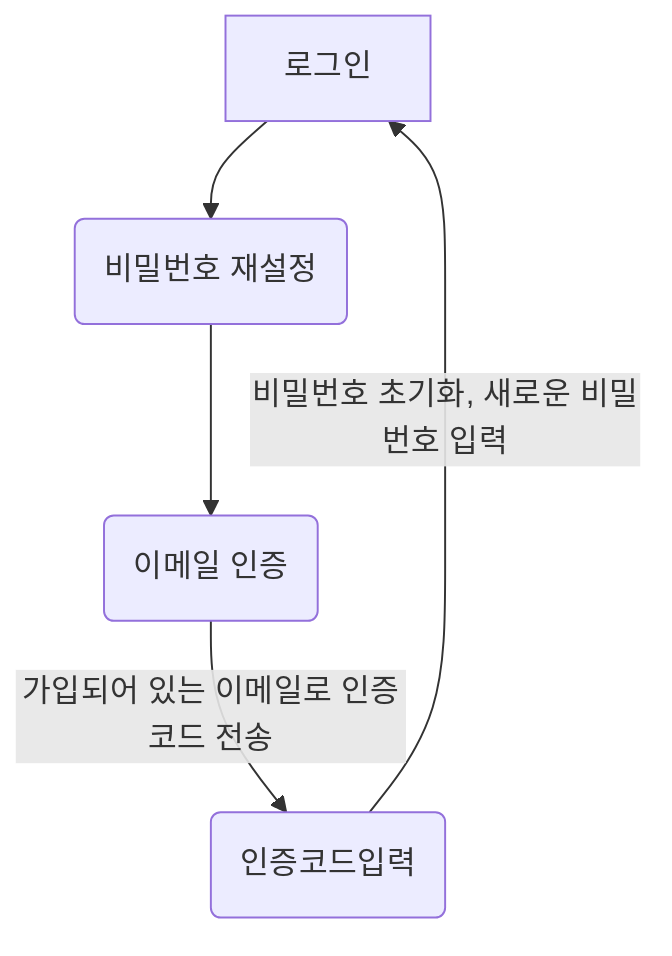

# 비밀번호 재설정 기능

## 플로우 차트

```mermaid
flowchart TD
    A[로그인] --> B(비밀번호 재설정)
    B --> C(이메일 인증)
    C -->|가입되어 있는 이메일로 인증코드 전송| D(인증코드입력)
    D -->|비밀번호 초기화, 새로운 비밀번호 입력| A
```

- 이때, 테스트 환경에서는 실제 이메일 전송 말고, 터미널에 코드가 나오도록 조정. 그리고 실제 배포 환경에서는 최소한의 수정으로 기능하도록 이미 구현을 해놓으세요.

- 보안 취약점에 대해 인지하고 대비하세요. 보안 관련해서는 security.md 파일과 일반적인 지식들을 활용하세요.