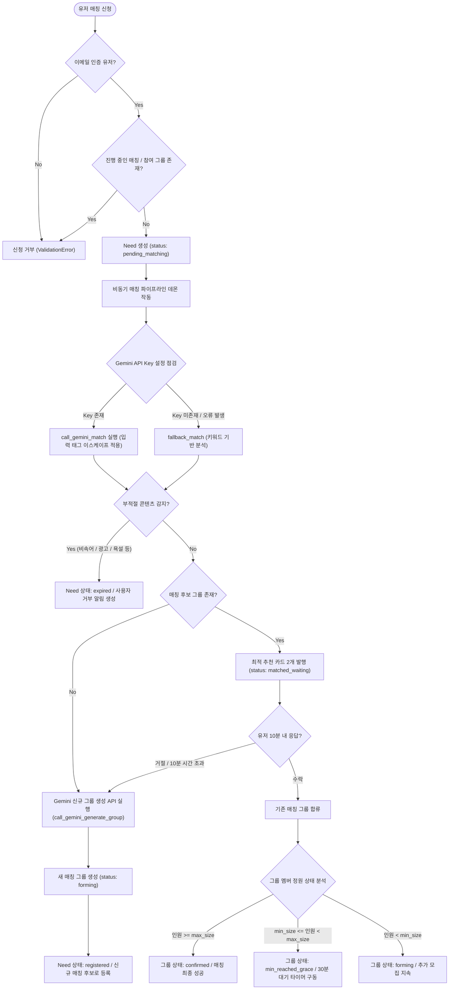
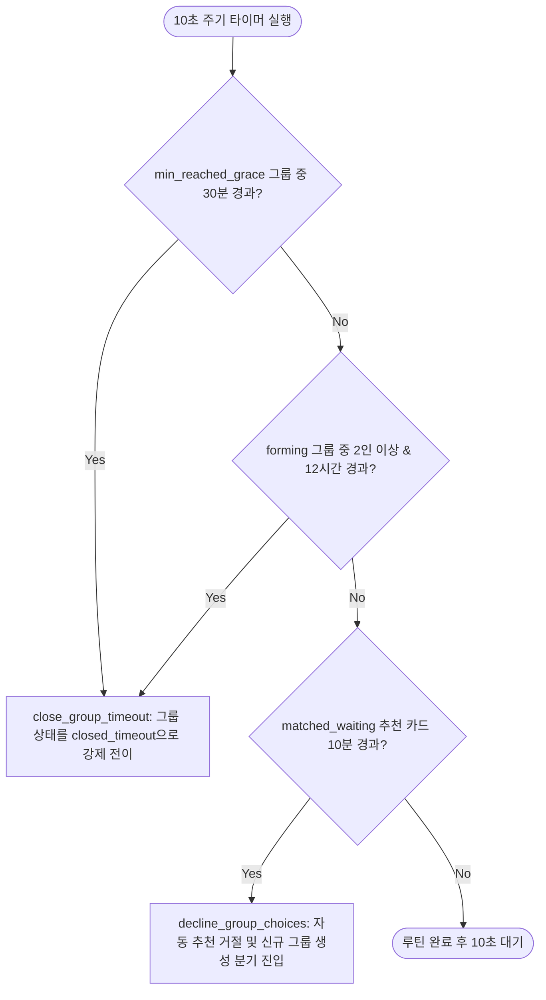
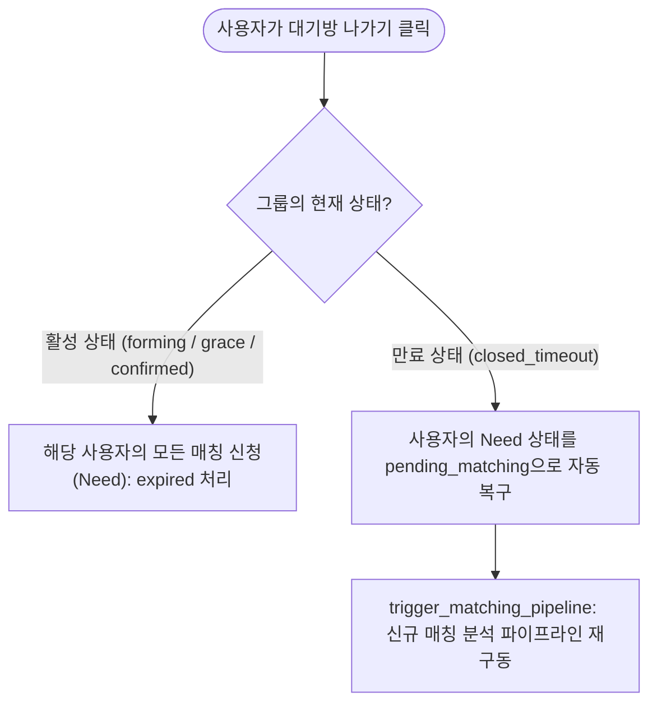

# CreditCampus System Business Flow Guide

이 문서는 CreditCampus 프로젝트의 핵심 비즈니스 로직인 **사용자 매칭 신청, AI 분석 및 추천, 백그라운드 타이머 상태 관리, 실시간 채널 동기화**가 어떠한 플로우로 맞물려 작동하는지 흐름도와 함께 단계별로 설명합니다.

---

## 1. 전체 매칭 라이프사이클 흐름도 (Mermaid Diagram)

사용자가 매칭을 요청한 순간부터 그룹이 최종적으로 확정되거나 대기방으로 진입할 때까지의 전체 비즈니스 흐름입니다.

---

## 2. 백그라운드 관리 데몬 동작 흐름도 (Mermaid Diagram)

프로젝트 기동 시 백그라운드에서 무한 루프로 작동하며, 10초 주기로 그룹 및 신청 카드의 임계 대기 시간을 추적하는 데몬 스레드의 검사 루틴입니다.

---

## 3. 대기 시간 만료 및 탈퇴 시 재매칭 순환 구조 (Mermaid Diagram)

대기 시간 만료(`closed_timeout`) 이후 사용자가 퇴장할 경우 자동으로 원래 신청 조건으로 재매칭을 시도하는 복원력 있는 사용자 흐름입니다.

---

## 4. 핵심 비즈니스 흐름 단계별 상세 명세

### ① 매칭 신청 유효성 검증 (`submit_need`)
- 사용자가 친구찾기, 스터디, 프로젝트 등의 유형과 정원 규모를 입력하여 매칭을 요청합니다.
- **가드 필터**: 이메일 미인증 사용자이거나, 이미 활성화된 매칭 요청(`pending_matching`, `matched_waiting`, `registered`) 혹은 진행 중인 매칭 그룹(`forming`, `min_reached_grace`, `confirmed`)에 참가 중인 경우 검증 에러(`ValidationError`)를 발생시켜 단일 매칭 원칙을 고수합니다.

### ② AI 파이프라인 분석 (`run_matching_pipeline`)
- 유효성 검증이 완료되면 비동기 백그라운드 스레드로 매칭 파이프라인이 작동합니다.
- **인젝션 방지 이스케이프**: Gemini LLM 프롬프트에 사용자의 세부 입력값을 그대로 보낼 경우 우회 명령 인젝션 위협이 있으므로, 입력 데이터 내부의 태그 문자(`<`, `>`)를 `[`, `]`로 치환하여 원천 차단합니다.
- **API 복원력 (Fallback)**: API 서버 연결 불안정 또는 할당량 초과 시, 최대 2회 재시도 후 즉시 키워드 일치율 분석 및 공통 키워드 가중치를 부여하는 `fallback_match` 알고리즘으로 매끄럽게 흐름을 전환합니다.
- **부적절성 판독**: Gemini 또는 Fallback 필터를 통해 비속어, 스팸, 광고성 내용이 발견될 경우 즉시 해당 신청 상태를 `expired`로 처리하고 사용자 알림을 저장한 뒤 파이프라인을 중단합니다.

### ③ 매칭 수락/거절 분기 처리 (`accept_group_choice` & `decline_group_choices`)
- **수락 시**:
  - `select_for_update()` 비관적 락(Pessimistic Lock)을 걸어 동시성 가입 요청에 의한 오버플로우를 차단합니다.
  - 그룹에 정상 진입 후 정원 상태에 따라 그룹 상태를 변경합니다.
    - 정원 충족 시: `confirmed` 상태가 되며 매칭 최종 성사 알림을 발송합니다.
    - 최소 인원 충족 시: `min_reached_grace`로 변경하며 30분의 모집 유예 시간을 적용합니다.
- **거절 및 타이머 초과 시**:
  - 추천을 사용자가 거절하거나 10분 유효 시간이 경과할 경우, 자동으로 추천 거절 루틴(`decline_group_choices`)이 동작하여 새로운 단독 대기 그룹을 생성하고 자신을 방장으로 가입시켜 매칭 대기 등록(`registered`) 상태로 전환합니다.

### ④ 실시간 채널 동기화 & 소통 (`WaitingRoomConsumer` & `ChatConsumer`)
- 대기방 인원 상태가 변화할 때마다 Django Channels의 Redis Channel Layer 그룹 전송(`group_send`)을 통해 브로드캐스팅(`waiting_room_message`)이 일어납니다. 클라이언트 웹 페이지는 이 소켓 신호를 감지하여 화면을 비동기 새로고침합니다.
- 채팅 채널의 경우 도배 및 부하 방지를 위해 클라이언트당 **0.3초 제한(Rate Limiting)**과 **150글자 글자 수 제약**이 적용되어 안정적인 WebSocket 인프라를 유지합니다.
