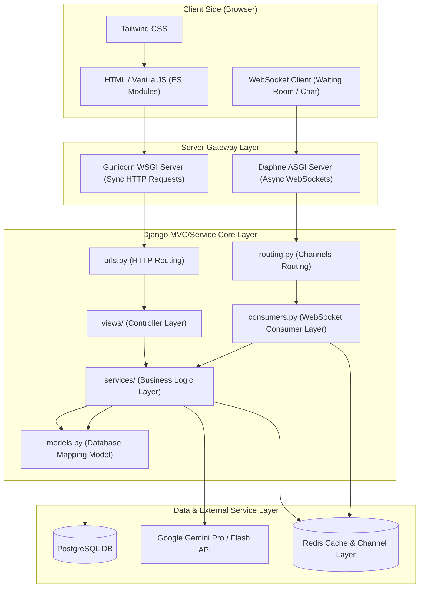

# CreditCampus Project Structure & Class Diagram

이 문서는 CreditCampus 프로젝트의 계층형 시스템 아키텍처와 Django 애플리케이션 앱 도메인 간의 결합성 및 데이터 흐름을 Mermaid 다이어그램을 활용하여 시각적으로 설명합니다.

---

## 1. 계층형 시스템 아키텍처 (Layered Architecture)

클라이언트의 요청이 들어와 웹 서버 게이트웨이를 거치고, Django 비동기/동기 제어 구조 및 영속성 레이어, 외부 AI 서비스까지 이어지는 논리적 다이어그램입니다.

---

## 2. 앱 도메인 관계 및 종속성 (App Domain Dependency Diagram)

CreditCampus는 도메인 주도 분리 원칙을 기반으로 개별 앱을 구현했습니다. 각 모듈이 서로 어떻게 참조하고 조화되는지에 대한 관계도입니다.

```mermaid
graph LR
    subgraph config ["config (Django Root Project)"]
        settings["settings.py"]
        urls_root["urls.py"]
        asgi["asgi.py"]
    end

    subgraph accounts ["accounts (User Domain)"]
        models_acc["models.py (User Profile)"]
        views_acc["views/ (auth, signup, profile)"]
        services_acc["services/ (email_verification)"]
    end

    subgraph aimatch ["aimatch (Matching & Communication Domain)"]
        models_ai["models.py (Need, Group, ChatMessage, Notification)"]
        views_ai["views.py"]
        consumers_ai["consumers.py (WebSockets)"]
        services_ai["services/ (match_service.py)"]
    end

    subgraph main ["main (Portal UI Domain)"]
        views_main["views.py (Home, MyPage, FAQ, Notices)"]
    end

    %% 루트 프로젝트의 앱 제어
    config --> accounts
    config --> aimatch
    config --> main

    %% 서비스 모듈 간 상호 연결 구조
    aimatch -. "인증 상태 및 프로필 정보 참조" .-> accounts
    main -. "세션 및 계정 유효성 체크" .-> accounts
    main -. "내 매칭 내역 및 채팅방으로 이동" .-> aimatch
```

---

## 3. 핵심 모듈 구성 요소 설명

### ① Client Side (Browser)
- **Vanilla CSS (Tailwind)**: UI 레이아웃을 작성하기 위해 사용되며, 인라인 스타일 없이 일관된 스타일 토큰으로 구현됩니다.
- **WebSocket**: 사용자 대기방의 정원 현황 변화를 즉시 통보받고 실시간 채팅 패킷을 브로드캐스트하는 역할을 합니다.

### ② Gateway & App Server
- **Gunicorn / Daphne 분할 처리**: Django 5.x의 ASGI 지원 덕분에 HTTP 정적/동기 API 요청은 Gunicorn이, 실시간 양방향 WebSocket 통신은 Daphne가 분담하여 병목 현상을 방지합니다.

### ③ Django MVC/Service Core Layer
- **views/**: HTTP 프로토콜의 파싱 및 유효성 처리를 담당하는 Controller 계층입니다.
- **services/**: 비즈니스 의사 결정 및 연산을 담당합니다. 뷰와 격리되어 결합도를 줄이고 단일 테스트 작성을 쉽게 돕습니다.
- **models.py**: PostgreSQL의 테이블 설계와 매핑되는 ORM(Object-Relational Mapping) 선언부입니다.

### ④ Data & External Service Layer
- **PostgreSQL**: 서비스의 신뢰성을 담보하며 정규화된 사용자의 정보, 영속적인 채팅 이력, 그리고 매칭 니즈(`Need`)를 보관합니다.
- **Redis Cache & Channel Layer**: 분산 세션 공유, 로그인 시도 실패(Brute-Force 방어) 횟수 트래킹, 그리고 Daphne 프로세스 간 WebSocket 채널 브로드캐스팅(Channel Layer)의 데이터 전달 통로 역할을 합니다.
- **Google Gemini API**: 유저들의 텍스트 기반 요청 사양(`Need`)을 수집하여 유사한 그룹으로 묶고 적절한 그룹이 없을 시 신규 명세(방 제목, 추천 태그)를 작성해 주는 자연어 인공지능 백엔드 역할을 합니다.
